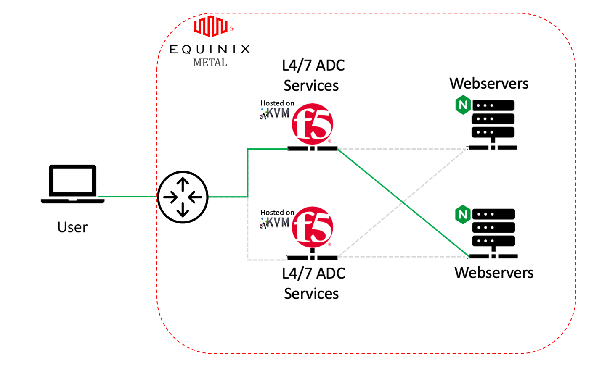
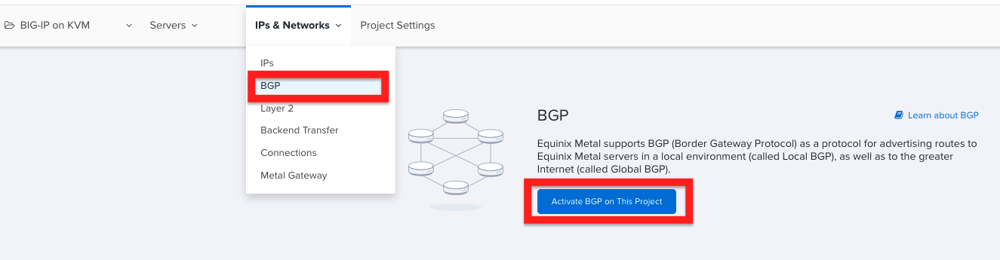
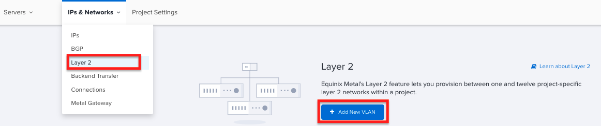
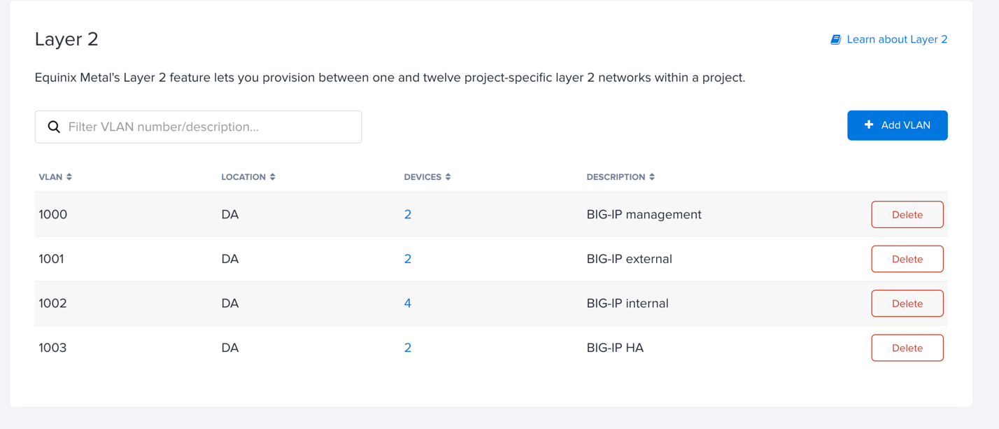
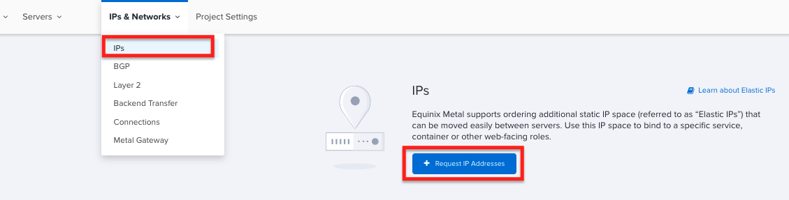
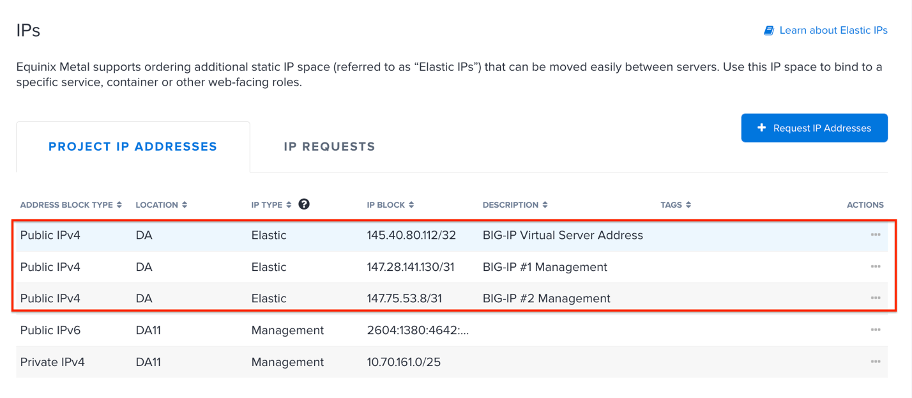

Introduction

With the release of Equinix Metal, enterprises now have a great option
for deploying resources on bare metal at the network edge. Additionally,
since Equinix Metal is integrated into the Equinix Fabric, it provides
an excellent location for a centralized access endpoint into an
organization’s multi-cloud environment.

However, as organizations move sensitive resources to the network edge,
it is extremely critical that security moves to the edge as well. The F5
BIG-IP, with its host of application security services, is well
positioned to meet this need with highly available, scalable, and secure
access to edge compute services as well multi-cloud environments.

This document provides guidance for deploying a highly available and
scalable application delivery infrastructure on top of Equinix Metal
using the F5 BIG-IP. As shown in Figure 1, the BIG-IP tier provides
advanced layer 4/7 traffic management and security services. In this
configuration, the BIG-IP instances can operate in either an “active/
active” or “active/standby” mode depending upon application requirements
and services utilized.

Figure 1: The BIG-IP tier provides advanced layer 4/7 traffic management
and security services

Prerequisites
=============

The following guidance assumes that you have an Equinix Metal account, a
basic understanding of the Equinix Metal platform and the deployment
process. Additionally, it is assumed the reader is familiar with KVM
hypervisor configuration as well as F5 BIG-IP application delivery
terminology and configuration as well as two BIG-IP license keys.

**A note about BGP in the Metal environment:**

Equinix Metal enables BGP to be used to advertise out either an IP
address block and ASN that you own or an elastic IP address block that
you rent from Equinix. However, while BGP peering can be established
between a Metal instance and the Equinix Metal routers, due to the Metal
architecture it isn’t possible to establish BGP peering directly with
the Metal routers and the BIG-IP running on the KVM hypervisor.

To overcome this limitation, this deployment uses the Ubuntu server
instance as a BGP intermediary and establishes BGP peering between the
BIG-IP and the BIRD routing engine on Ubuntu which is also used to
establish BGP peering with the Metal routers.

The BIG-IP is configured to advertise the virtual server elastic IP
address block to BIRD on Ubuntu and BIRD advertises this block to the
Equinix Metal routers.

Enable BGP on project
---------------------

This deployment uses BGP to advertise the BIG-IP virtual server IP
addresses to the world and BGP must be enabled at the project level
using **Local BGP** option. BGP also needs to be enabled on each Metal
server and you will do that in a later step.

Figure 2: BGP must be enabled at the project level using **Local BGP**
option

Create layer 2 VLANs
--------------------

You first create four layer 2 VLANs in the Equinix Metal location where
all the servers reside, as shown in Figure 3. Name the VLANs as desired
and note the VLAN number that is assigned to each VLAN because it will
be needed when configuring the Ubuntu network settings in a later step.

Figure 3: Create four layer 2 VLANs in the Equinix Metal location where
all the servers reside.

Once all of the VLANs have been created, the list of VLANs will look
similar to what is shown in Figure 4.

Figure 4: Once all of the VLANs have been created, the list of VLANs
will look similar to this.

Request Elastic IP Addresses
----------------------------

| Equinix Metal elastic IP addresses are public IPv4 addresses that
  users request and rent by the hour. For this deployment, you will need
  a total of five elastic IP addresses: two for each BIG-IP management
  interface and one for the BIG-IP virtual server address that will be
  advertised out to the world using BGP.
| More specifically, you will need to request a **Public IPv4** address
  block that is a /31 in CIDR notation for **each** BIG-IP as well as a
  **Public IPv4** address block that is a /32 in CIDR notation. These
  addresses will be used later in the deployment process.

The elastic IP addresses are location specific and you will need to make
sure that you request them for the same location that your Metal you
intend to deploy your Metal instances. It’s also a good idea to provide
a description for each elastic IP block to make it easier to know which
block to assign to each BIG-IP.

Figure 5: For this deployment, you will need a total of five elastic IP
addresses.

Once the three elastic IP address blocks have been requested, the list
of addresses will look similar to what is shown in Figure 6.

Figure 6: The three elastic IP address blocks.