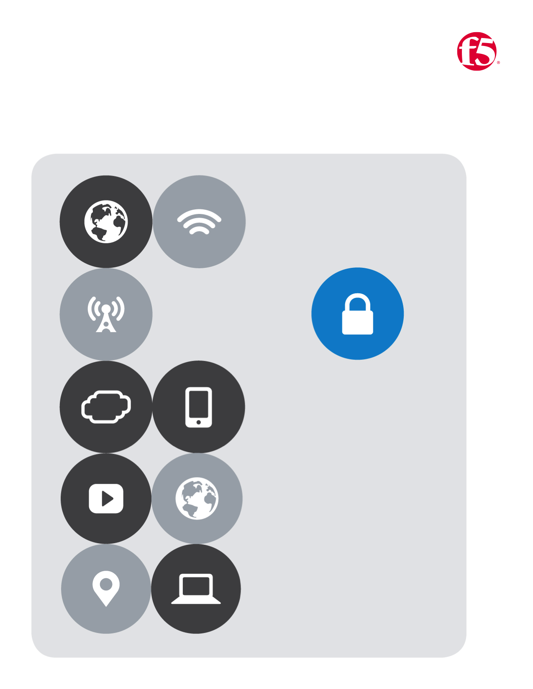
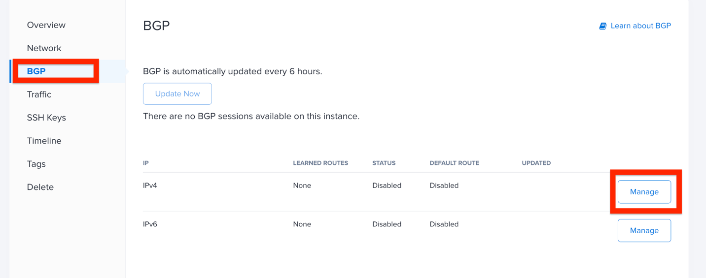
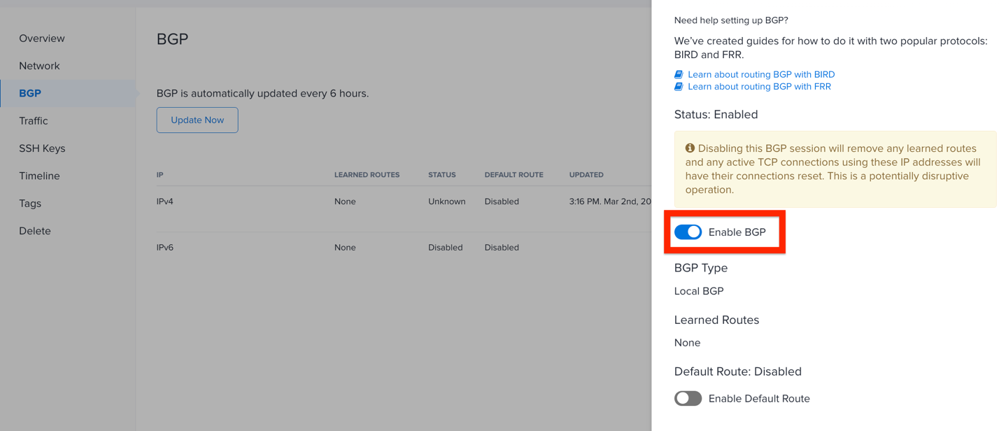
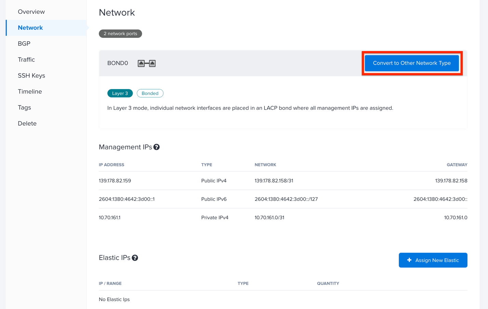
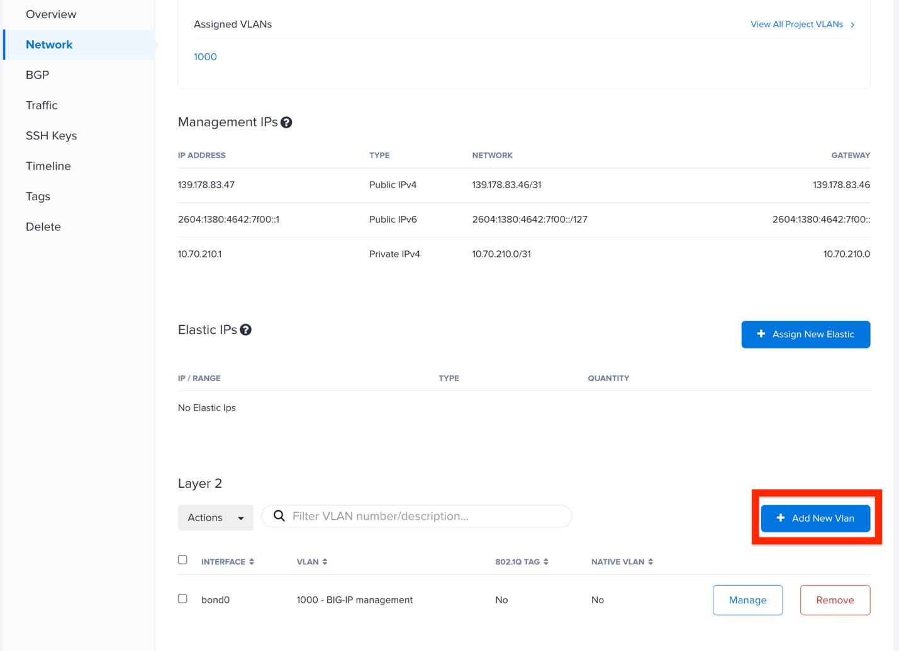
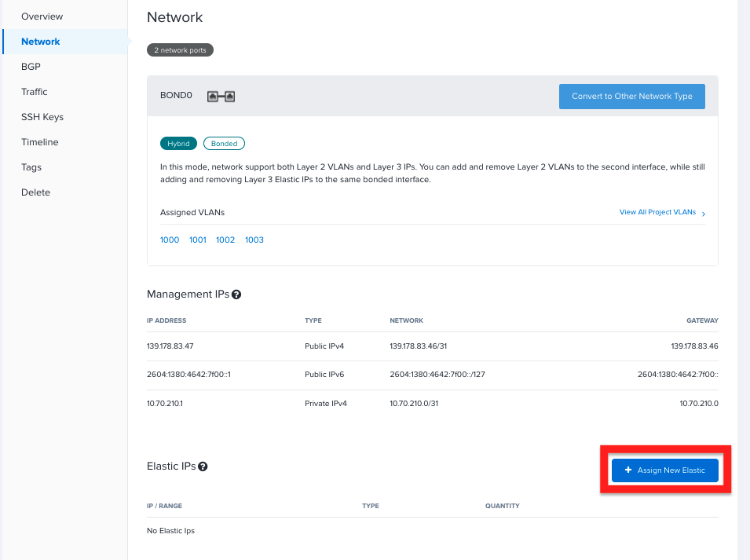

BIG-IP on KVM on Equinix Metal

April 14, 2022

Contents

`Prerequisites 3 <#prerequisites>`__

`Enable BGP on project 4 <#enable-bgp-on-project>`__

`Create layer 2 VLANs 4 <#create-layer-2-vlans>`__

`Request Elastic IP Addresses 5 <#request-elastic-ip-addresses>`__

`Deploy and Configure Ubuntu KVM hypervisor hosts
6 <#deploy-and-configure-ubuntu-kvm-hypervisor-hosts>`__

`Install bare metal Ubuntu instances
6 <#install-bare-metal-ubuntu-instances>`__

`Populate user data section 7 <#populate-user-data-section>`__

`Enable BGP on Metal instances 8 <#enable-bgp-on-metal-instances>`__

`Convert Metal network 9 <#convert-metal-network>`__

`Assign elastic IP addresses 11 <#assign-elastic-ip-addresses>`__

`Modify instance network configuration
12 <#modify-instance-network-configuration>`__

`Deploy BIG-IP VM 15 <#deploy-big-ip-vm>`__

`Configure BIG-IP 16 <#configure-big-ip>`__

`Configure BIRD BGP routing daemon on Ubuntu
17 <#configure-bird-bgp-routing-daemon-on-ubuntu>`__

`Confirm BIRD BGP neighbors 18 <#confirm-bird-bgp-neighbors>`__

`Deploy Sample NGINX Back-end Web Servers
18 <#deploy-sample-nginx-back-end-web-servers>`__

`Deploy Metal Ubuntu instances 19 <#deploy-metal-ubuntu-instances>`__

`Populate user data section 19 <#populate-user-data-section-1>`__

`Convert Metal network 19 <#convert-metal-network-1>`__

`Modify instance network configuration
19 <#modify-instance-network-configuration-1>`__

`Test Deployment 20 <#test-deployment>`__

Introduction

With the release of Equinix Metal, enterprises now have a great option
for deploying resources on bare metal at the network edge. Additionally,
since Equinix Metal is integrated into the Equinix Fabric, it provides
an excellent location for a centralized access endpoint into an
organization’s multi-cloud environment.

However, as organizations move sensitive resources to the network edge,
it is extremely critical that security moves to the edge as well. The F5
BIG-IP, with its host of application security services, is well
positioned to meet this need with highly available, scalable, and secure
access to edge compute services as well multi-cloud environments.

This document provides guidance for deploying a highly available and
scalable application delivery infrastructure on top of Equinix Metal
using the F5 BIG-IP. As shown in Figure 1, the BIG-IP tier provides
advanced layer 4/7 traffic management and security services. In this
configuration, the BIG-IP instances can operate in either an “active/
active” or “active/standby” mode depending upon application requirements
and services utilized.

|Diagram Description automatically generated|

Figure 1: The BIG-IP tier provides advanced layer 4/7 traffic management
and security services

Prerequisites
=============

The following guidance assumes that you have an Equinix Metal account, a
basic understanding of the Equinix Metal platform and the deployment
process. Additionally, it is assumed the reader is familiar with KVM
hypervisor configuration as well as F5 BIG-IP application delivery
terminology and configuration as well as two BIG-IP license keys.

**A note about BGP in the Metal environment:**

Equinix Metal enables BGP to be used to advertise out either an IP
address block and ASN that you own or an elastic IP address block that
you rent from Equinix. However, while BGP peering can be established
between a Metal instance and the Equinix Metal routers, due to the Metal
architecture it isn’t possible to establish BGP peering directly with
the Metal routers and the BIG-IP running on the KVM hypervisor.

To overcome this limitation, this deployment uses the Ubuntu server
instance as a BGP intermediary and establishes BGP peering between the
BIG-IP and the BIRD routing engine on Ubuntu which is also used to
establish BGP peering with the Metal routers.

The BIG-IP is configured to advertise the virtual server elastic IP
address block to BIRD on Ubuntu and BIRD advertises this block to the
Equinix Metal routers.

Enable BGP on project
---------------------

This deployment uses BGP to advertise the BIG-IP virtual server IP
addresses to the world and BGP must be enabled at the project level
using **Local BGP** option. BGP also needs to be enabled on each Metal
server and you will do that in a later step.

|Graphical user interface Description automatically generated with
medium confidence|

Figure 2: BGP must be enabled at the project level using **Local BGP**
option

Create layer 2 VLANs
--------------------

You first create four layer 2 VLANs in the Equinix Metal location where
all the servers reside, as shown in Figure 3. Name the VLANs as desired
and note the VLAN number that is assigned to each VLAN because it will
be needed when configuring the Ubuntu network settings in a later step.

|Graphical user interface Description automatically generated|

Figure 3: Create four layer 2 VLANs in the Equinix Metal location where
all the servers reside.

Once all of the VLANs have been created, the list of VLANs will look
similar to what is shown in Figure 4.

|Graphical user interface, application Description automatically
generated|

Figure 4: Once all of the VLANs have been created, the list of VLANs
will look similar to this.

Request Elastic IP Addresses
----------------------------

| Equinix Metal elastic IP addresses are public IPv4 addresses that
  users request and rent by the hour. For this deployment, you will need
  a total of five elastic IP addresses: two for each BIG-IP management
  interface and one for the BIG-IP virtual server address that will be
  advertised out to the world using BGP.
| More specifically, you will need to request a **Public IPv4** address
  block that is a /31 in CIDR notation for **each** BIG-IP as well as a
  **Public IPv4** address block that is a /32 in CIDR notation. These
  addresses will be used later in the deployment process.

The elastic IP addresses are location specific and you will need to make
sure that you request them for the same location that your Metal you
intend to deploy your Metal instances. It’s also a good idea to provide
a description for each elastic IP block to make it easier to know which
block to assign to each BIG-IP.

|Graphical user interface, application Description automatically
generated|

Figure 5: For this deployment, you will need a total of five elastic IP
addresses.

Once the three elastic IP address blocks have been requested, the list
of addresses will look similar to what is shown in Figure 6.

|Graphical user interface, application Description automatically
generated|

Figure 6: The three elastic IP address blocks.

Deploy and Configure Ubuntu KVM hypervisor hosts
================================================

Install bare metal Ubuntu instances 
------------------------------------

Install two (2) Ubuntu 20.04 LTS on-demand Metal Instances. Select a
size that supports hybrid and layer 2 networking modes (servers with 2x
10gbps ports); provide names and populate the Add User Data section (see
Figure 7).

In the following example, the Dallas location and c3.small.x86 instance
size has been selected along with Ubuntu 20.04, but you may deploy from
other Equinix Metal locations.

|Graphical user interface, application, website, Teams Description
automatically generated|\ Figure 7: Install two (2) Ubuntu 20.04 LTS
on-demand Metal Instances.

Populate user data section
--------------------------

Equinix Metal supports cloud-init functionality which, among other
things, allows for files to be written and packages to be installed
during the initial startup phase of Ubuntu. On the Metal server
deployment page, enable the **Add User Data** section and populate with
the following:

.. code:: bash

   #cloud-config

   package_upgrade: true

   packages:
   - qemu-kvm
   - virt-manager
   - libvirt-daemon-system
   - libvirt-clients
   - virtinst
   - virt-viewer
   - bridge-utils
   - bird
   - unzip
   - python3-pip

   runcmd:
   - systemctl start libvirtd
   - virsh net-undefine default
   - virsh net-destroy default
   - echo "vm.nr_hugepages=1200" >> /etc/sysctl.conf
   - echo "net.ipv4.ip_forward=1" >> /etc/sysctl.conf
   - echo "net.bridge.bridge-nf-call-ip6tables=0" >> /etc/sysctl.conf
   - echo "net.bridge.bridge-nf-call-iptables=0" >> /etc/sysctl.conf

After populating the **Add User Data** section, press the **Deploy Now**
button to begin the deployment process. It can take a few minutes after
the servers are available in the dashboard for all the packages to be
installed and for the servers to be fully available and ready to be
configured. If you find that a package defined to be installed is not,
wait a few minutes and check again.

Enable BGP on Metal instances
-----------------------------

Once the servers are up and available, BGP for IPv4 also needs be
enabled on each Ubuntu server instance.

|Graphical user interface, application Description automatically
generated|

|Graphical user interface, application, Teams Description automatically
generated|

Figure 8: BGP for IPv4 needs be enabled on each Ubuntu server instance.

Convert Metal network
---------------------

When a Metal instance is first deployed, the two NICs are connected to
two different switches, bonded together into a single, logical interface
and supporting layer 3 only. To support the layer-2 VLANs needed for
BIG-IP deployment, the Metal network configuration needs to be converted
to **Hybrid Bonded** which supports both layer 2 and layer 3 networking.

As part of the network conversion process, you will have to assign one
of the VLANs you created earlier. You can select any VLAN and you will
assign the remaining three once the network conversion is complete. (See
Figure 9, next page.)

|Graphical user interface, application Description automatically
generated|

Figure 9: As part of the network conversion process, you assign one of
the VLANs created earlier.

After the Metal network has been converted to hybrid bonded mode, assign
the three remaining VLANs to each Ubuntu instance. (See Figure 10 on the
next page.)

|Graphical user interface, application, Teams Description automatically
generated|

Figure 10: Assign the three remaining VLANs to each Ubuntu instance.

Assign elastic IP addresses
---------------------------

To connect to the BIG-IP management interface from outside the Metal
environment, you need to assign a **Public IPv4** /31 elastic IP address
block that you provisioned in a previous step to **each** Ubuntu
instance. (See Figure 11 on the next page.)

|Graphical user interface, application Description automatically
generated|

Figure 11: Assign a Public IPv4 /31 elastic IP address block (already
provisioned) to each Ubuntu instance.

Modify instance network configuration 
--------------------------------------

| **NOTE:** You will need to log in to each Ubuntu server via SSH
  instance using the auto-assigned Metal instance management IP address
  to complete this section. This management IP address does not need to
  be changed and is NOT the same as the BIG-IP management IP address.
| This deployment example uses KVM network bridging and the network
  configuration of both Ubuntu instances needs to be modified to support
  this mode. The layer 2 VLANs are tagged and defined as a subinterface
  of the **bond0** interface and the naming convention is **bond0.<VLAN
  number>.** For this deployment example, the tagged interfaces are
  **bond0.1000, bond0.1001, bond0.1002 and bond0.1003**. Depending on
  the VLAN numbers that were auto assigned, your interface names may be
  different, and you will need to modify as needed.

Only the BIG-IP management interface—bond0.1000 in this case—uses a
public IP address while the rest of the new interfaces use RFC1918
private IP addresses.

Edit the interfaces configuration file and append the interface
configuration commands to the bottom of the file, adjusting the new
interface names to match your assigned VLAN numbers. There are two sets
of interface configuration commands below, one for each Ubuntu instance.
Be sure to use different RFC1918 IP addresses for each Ubuntu instance,
while making sure that the matching interfaces are in the same subnet.

| Additionally, the BIG-IP management IP address—highlighted below in
  red—need to be changed to match the **first** address of the elastic
  IP address blocks that you requested in a previous step.
| As an example, if the /31 elastic IP address block you requested was
  147.28.141.130/31, the IP address you would define on the Ubuntu
  network configuration would be 147.28.141.130. In a later step, you
  will assign the second IP address of the block—147.28.141.131—as the
  BIG-IP management IP address.

**Ubuntu #1**

vi /etc/network/interfaces

auto br0
iface br0 inet static
address <first IP of BIG-IP mgmt address block>
netmask 255.255.255.254
bridge_ports bond0.1000
bridge_stp off
bridge-fd 0
bridge_maxwait 0

auto bond0.1001
iface bond0.1001 inet manual
pre-up sleep 5
vlan-raw-device bond0
auto br1
iface br1 inet static
address 192.168.10.10
netmask 255.255.255.0
bridge_ports bond0.1001
bridge_stp off
bridge-fd 0
bridge_maxwait 0

auto bond0.1002
iface bond0.1002 inet manual
pre-up sleep 5
vlan-raw-device bond0

auto br2
iface br2 inet static
address 192.168.20.10
netmask 255.255.255.0
bridge_ports bond0.1002
bridge_stp off
bridge-fd 0
bridge_maxwait 0

auto bond0.1003
iface bond0.1003 inet manual
pre-up sleep 5
vlan-raw-device bond0

auto br3
iface br3 inet static
address 192.168.30.10
netmask 255.255.255.0
bridge_ports bond0.1003
bridge_stp off
bridge-fd 0
bridge_maxwait 0

**Ubuntu #2**

vi /etc/network/interfaces

auto br0
iface br0 inet static
address <first IP of BIG-IP mgmt address block>
netmask 255.255.255.254
bridge_ports bond0.1000
bridge_stp off
bridge-fd 0
bridge_maxwait 0

auto bond0.1001
iface bond0.1001 inet manual
pre-up sleep 5
vlan-raw-device bond0
auto br1
iface br1 inet static
address 192.168.10.20
netmask 255.255.255.0
bridge_ports bond0.1001
bridge_stp off
bridge-fd 0
bridge_maxwait 0

auto bond0.1002
iface bond0.1002 inet manual
pre-up sleep 5
vlan-raw-device bond0

auto br2
iface br2 inet static
address 192.168.20.20
netmask 255.255.255.0
bridge_ports bond0.1002
bridge_stp off
bridge-fd 0
bridge_maxwait 0

auto bond0.1003
iface bond0.1003 inet manual
pre-up sleep 5
vlan-raw-device bond0

auto br3
iface br3 inet static
address 192.168.30.20
netmask 255.255.255.0
bridge_ports bond0.1003
bridge_stp off
bridge-fd 0
po0 mnbridge_maxwait 0

Restart networking services to enable the new configuration.

systemctl restart networking

Next, validate communication between the Ubuntu servers by pinging from
one to the corresponding VLAN IP address of the other, *e.g.*,
192.168.10.10 -> 192.168.10.20.

Deploy BIG-IP VM
================

Now that the KVM hypervisor networking is properly configured, download
the latest **qcow2 BIG-IP** image from downloads.f5.com and perform the
following steps on each Ubuntu instance:

Unzip and copy the downloaded image file to the /var/lib/libvirt/images
directory

Next, create BIG-IP virtual machine using virt-install utility,
adjusting the image name (highlighted in red) as appropriate.

virt-install --name big-ip --ram 16384 --vcpus=8 --os-variant=centos7.0
\\

--network bridge=br0,model=virtio \\

--network bridge=br1,model=virtio \\

--network bridge=br2,model=virtio \\

--network bridge=br3,model=virtio \\

--accelerate \\

--disk
path=/var/lib/libvirt/images/BIGIP-16.1.2.1-0.0.10.qcow2,bus=virtio,cache=none,size=96
\\

--noautoconsole --noreboot --import

Start the virtual machine and also set to autostart when Ubuntu is
rebooted:

| virsh start big-ip
| virsh autostart big-ip

Get the console number of the BIG-IP virtual machine:

virsh list

After waiting a few minutes, connect to BIG-IP console using console ID
number. For example, if the number 1 was returned from the **virsh
list** command:

virsh console 1

Login to BIG-IP and change password for root from the default.
Additionally, while the admin password is also changed at the same time
as the root password, it’s marked as expired and must be changed the
next time the admin user logs in. To avoid having the change the admin
password later, use the following TMSH commands to change it now:

| tmsh modify auth password admin
| tmsh save /sys config

Configure BIG-IP management interface and set IP address to second
elastic IP address of the /31 used for management and set management
route to the first elastic IP address of the /31 used for BIG-IP
management.

For example, if the Metal elastic IP address block is
**147.28.141.130/31**, configure the management IP address to be
**147.28.141.131** and the management route to be **147.28.141.130**.

Configure BIG-IP
----------------

Instead of using the BIG-IP web UI to configure the BIG-IP, you will use
the BIG-IP CLI and TMSH commands to configure the BIG-IP instances.
Below, are two sets of commands: one for BIG-IP #1 and the other for
BIG-IP #2. You will need to supply a unique license key for each BIG-IP
as well as adjust references to IP addresses to match the IP addresses
you are using.

Once all of the TMSH commands have been entered on both BIG-IP
instances, you should have an active/standby pair of BIG-IPs up and
ready to go.

**NOTE:** The KVM console can be a little difficult to work with and you
may want to use SSH to configure the BIG-IP instances instead. Also,
highlighted below in red are entries that you may have to change;
however, if you have used the same RFC1918 IP addresses, then the only
items you will have to change are the license key and the virtual server
elastic IP address block.

**BIG-IP #1**

..code:: bash

   tmsh modify sys global-settings hostname bigip-1.example.com
   tmsh create net vlan external interfaces add {1.1}
   tmsh create net vlan internal interfaces add {1.2}
   tmsh create net vlan ha interfaces add {1.3}
   tmsh create net self 192.168.20.11/24 vlan internal allow-service
   default
   tmsh create net self 192.168.10.11/24 vlan external allow-service
   default
   tmsh create net self 192.168.30.11/24 vlan ha allow-service default
   tmsh modify sys global-settings gui-setup disabled
   tmsh mv cm device bigip1 bigip-1.example.com
   tmsh modify cm device bigip-1.example.com configsync-ip 192.168.30.11
   tmsh modify cm device bigip-1.example.com unicast-address {{ ip
   192.168.30.11 }}
   tmsh modify sys db tmrouted.tmos.routing value enable
   tmsh create net routing bgp my_bgp_config local-as 65000 neighbor add {
   192.168.10.10 { remote-as 65000 } } network add { <virtual server
   elastic IP address block/CIDR> } graceful-restart { restart-time 120 }
   tmsh modify /sys dns name-servers add { 8.8.8.8 }
   tmsh modify /sys ntp servers add { pool.ntp.org }
   tmsh install /sys license registration-key <license key>
   tmsh save sys config

**BIG-IP #2**

..code:: bash

   tmsh modify sys global-settings hostname bigip-2.example.com
   tmsh create net vlan external interfaces add {1.1}
   tmsh create net vlan internal interfaces add {1.2}
   tmsh create net vlan ha interfaces add {1.3}
   tmsh create net self 192.168.20.21/24 vlan internal allow-service
   default
   tmsh create net self 192.168.10.21/24 vlan external allow-service
   default
   tmsh create net self 192.168.30.21/24 vlan ha allow-service default
   tmsh modify sys global-settings gui-setup disabled
   tmsh mv cm device bigip1 bigip-2.example.com
   tmsh modify cm device bigip-2.example.com configsync-ip 192.168.30.21
   tmsh modify cm device bigip-2.example.com unicast-address {{ ip
   192.168.30.21 }}
   tmsh modify /cm trust-domain /Common/Root add-device { device-ip
   192.168.30.11 device-name bigip-1.example.com username admin password
   <**admin password of BIG-IP #1**> ca-device true }
   tmsh create cm device-group devicegroup-1 devices add
   {bigip-1.example.com bigip-2.example.com} type sync-failover auto-sync
   enabled
   tmsh run cm config-sync to-group devicegroup-1
   tmsh modify sys db tmrouted.tmos.routing value enable
   tmsh create net routing bgp my_bgp_config local-as 65000 neighbor add {
   192.168.10.20 { remote-as 65000 } } network add { <virtual server
   elastic IP address block/CIDR> } graceful-restart { restart-time 120 }
   tmsh modify /sys dns name-servers add { 8.8.8.8 }
   tmsh modify /sys ntp servers add { pool.ntp.org }
   tmsh install /sys license registration-key <license key>
   tmsh create ltm pool nginx members add { 192.168.20.100:http
   192.168.20.110:http } monitor http
   tmsh create ltm virtual nginx { destination <virtual server elastic IP
   address block>:80 pool nginx ip-protocol tcp source-address-translation
   { type automap } translate-address enabled translate-port enabled }
   tmsh save sys config

Configure BIRD BGP routing daemon on Ubuntu
-------------------------------------------

The BIRD routing daemon provides BGP routing capability and will be used
to establish BGP neighbors with both the Equinix Metal routers as well
as the BIG-IP instances. Equinix Metal provides a convenience script
that performs the initial configuration of the BIRD routing engine. To
use the script, perform the following:

git clone https://github.com/packethost/network-helpers.git
cd network-helpers
pip3 install jmespath
pip3 install -e .
./configure.py -r bird \| tee /etc/bird/bird.conf

The script configures BIRD to establish BGP neighbors with the two
Equinix Metal router instances. However, BIRD needs to be configured to
also establish a BGP neighbor with the BIG-IP as well. The neighbor IP
address for the BIG-IP is the external VLAN self-ip address.

Modify the BIRD configuration file and add a static route to the BIG-IP
external VLAN self-ip address and add the BIG-IP as a BGP neighbor

**Ubuntu #1**

nano vi /etc/bird/bird.conf

Locate the **protocol static** section and add the following between the
curly braces:

route 192.168.10.11/32 via 192.168.10.10;

At the bottom of the file, add the following:

protocol bgp neighbor_v4_3 {

export filter packet_bgp;

local as 65000;

neighbor 192.168.10.11 as 65000;

}

**Ubuntu #2**

nano vi /etc/bird/bird.conf

Locate the **protocol static** section and add the following between the
curly braces:

route 192.168.10.21/32 via 192.168.10.20;

At the bottom of the file, add the following:

protocol bgp neighbor_v4_3 {
export filter packet_bgp;
local as 65000;
neighbor 192.168.10.21 as 65000;
}

Save that file and restart the BIRD service:

systemctl restart bird

Confirm BIRD BGP neighbors
--------------------------

Using the BIRD utility, confirm that that the two Metal routers and the
BIG-IP are neighbors and that the virtual server IP address block is
being advertised:

birdc show route

The output should look similar to the below (elastic IP address block
highlighted for clarity):

BIRD 1.6.8 ready.

192.168.10.11/32 via 192.168.10.10 on br1 [static1 2022-02-02] ! (200)
39.178.82.246/31 via 192.168.10.10 on br1 [neighbor_v4_3 2022-02-02 from
192.168.10.11] ! (100/?) [i]
169.254.255.2/32 via 139.178.83.46 on bond0 [static1 2022-02-02] \*
(200)
169.254.255.1/32 via 139.178.83.46 on bond0 [static1 2022-02-02] \*
(200)

You may further validate that BGP neighbors have been established:

birdc show protocols

The output should look similar to the below (BIG-IP neighbor highlighted
in red):

BIRD 1.6.8 ready.
name proto table state since info
direct1 Direct master up 22:28:57
kernel1 Kernel master up 22:28:57
static1 Static master up 22:28:57
device1 Device master up 22:28:57
neighbor_v4_1 BGP master up 22:29:58 Established
neighbor_v4_2 BGP master up 22:31:01 Established
neighbor_v4_3 BGP master up 22:29:47 Established

Deploy Sample NGINX Back-end Web Servers 
=========================================

In this section, you will deploy two new Metal instances that will host
the Nginx web servers. The process to deploy and configure these two new
Ubuntu instances is similar to the two servers you deployed in previous
steps.

Deploy Metal Ubuntu instances 
------------------------------

Deploy two (2) additional Ubuntu 20.04 LTS on-demand Metal Instances.
Select a size that supports hybrid and layer 2 networking modes (servers
with 2x 10gbps ports); provide names and populate the **Add User Data**
section (see below).

.. _populate-user-data-section-1:

Populate user data section
--------------------------

Equinix Metal supports cloud-init functionality which, among other
things, allows for files to be written and packages to be installed
during the initial startup phase of Ubuntu. On the Metal server
deployment page, enable the **Add User Data** section and populate with
the following:

#cloud-config

package_upgrade: true

packages:
- nginx

After populating the **Add User Data** section, press the **Deploy Now**
button to begin the deployment process. It can take a few minutes after
the servers are available in the dashboard for all the packages to be
installed and for the servers to be fully available and ready to be
configured. If you find that a package defined to be installed is not,
wait a few minutes and check again.

.. _convert-metal-network-1:

Convert Metal network 
----------------------

| When a Metal instance is first deployed, the two NICs are connected to
  two different switches, bonded together in to a single, logical
  interface and support layer 3 only. To support the layer 2 VLANs
  needed for BIG-IP deployment, the Metal network configuration needs to
  be converted to **hybrid bonded** which supports both layer 2 and
  layer 3 networking.
| As a part of the network conversion process, you will have to assign
  one of the VLANs you created earlier and, for these servers, select
  the VLAN you defined earlier for the internal network.

.. _modify-instance-network-configuration-1:

Modify instance network configuration 
--------------------------------------

Edit the interfaces configuration file and append the interface
configuration commands to the bottom of the file, adjusting the new
interface name to match your assigned VLAN number. Be sure to use
different RFC1918 IP addresses for each Ubuntu instance, while making
sure that the matching interfaces are in the same subnet.

**Ubuntu #1**

vi /etc/network/interfaces

auto bond0.1002
iface bond0.1002 inet static
address 192.168.20.100
netmask 255.255.255.0
pre-up sleep 5
vlan-raw-device bond0

**Ubuntu #2**

vi /etc/network/interfaces

auto bond0.1002
iface bond0.1002 inet static
address 192.168.20.110
netmask 255.255.255.0
pre-up sleep 5

vlan-raw-device bond0

Restart networking services to enable the new configuration.

systemctl restart networking

Next, validate communication between the Ubuntu servers and the BIG-IP
instances by pinging the BIG-IP internal VLAN IP addresses:
**192.168.20.11** & **192.168.20.21**.

Test Deployment
===============

At this point, you can test the entire deployment by pointing a web
browser to the virtual server IP address that was defined earlier when
you allocated an elastic IP address block for it:

http://<elastic IP address block>/

Congratulations! You now have a cluster that routes traffic evenly
between web servers and is capable of failing over to a standby system
for high availability.

.. |Diagram Description automatically generated| image:: ../images/image2.png
   :width: 6.5in
   :height: 4.06806in
.. |Graphical user interface Description automatically generated with medium confidence| image:: ../images/image3.png
   :width: 6.5in
   :height: 1.68889in
.. |Graphical user interface Description automatically generated| image:: ../images/image4.png
   :width: 6.5in
   :height: 1.37639in
.. |Graphical user interface, application Description automatically generated| image:: ../images/image5.png
   :width: 6.5in
   :height: 2.78958in
.. |Graphical user interface, application Description automatically generated| image:: ../images/image6.png
   :width: 6.5in
   :height: 1.65208in
.. |Graphical user interface, application Description automatically generated| image:: ../images/image7.png
   :width: 6.5in
   :height: 2.83611in
.. |Graphical user interface, application, website, Teams Description automatically generated| image:: ../images/image8.png
   :width: 6.5in
   :height: 5.57431in

