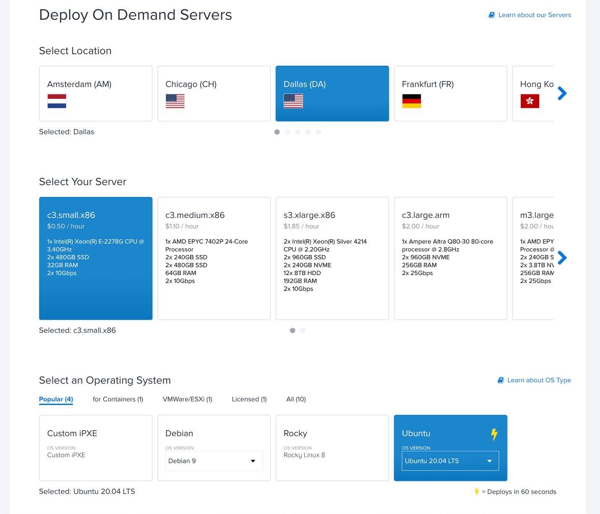

Deploy and Configure Ubuntu KVM hypervisor hosts
================================================

Install bare metal Ubuntu instances 
------------------------------------

Install two (2) Ubuntu 20.04 LTS on-demand Metal Instances. Select a
size that supports hybrid and layer 2 networking modes (servers with 2x
10gbps ports); provide names and populate the Add User Data section (see
Figure 7).

In the following example, the Dallas location and c3.small.x86 instance
size has been selected along with Ubuntu 20.04, but you may deploy from
other Equinix Metal locations.

Figure 7: Install two (2) Ubuntu 20.04 LTS
on-demand Metal Instances. 

Populate user data section
--------------------------

Equinix Metal supports cloud-init functionality which, among other
things, allows for files to be written and packages to be installed
during the initial startup phase of Ubuntu. On the Metal server
deployment page, enable the **Add User Data** section and populate with
the following:

.. code:: bash

   #cloud-config

   package_upgrade: true

   packages:
   - qemu-kvm
   - virt-manager
   - libvirt-daemon-system
   - libvirt-clients
   - virtinst
   - virt-viewer
   - bridge-utils
   - bird
   - unzip
   - python3-pip

   runcmd:
   - systemctl start libvirtd
   - virsh net-undefine default
   - virsh net-destroy default
   - echo "vm.nr_hugepages=1200" >> /etc/sysctl.conf
   - echo "net.ipv4.ip_forward=1" >> /etc/sysctl.conf
   - echo "net.bridge.bridge-nf-call-ip6tables=0" >> /etc/sysctl.conf
   - echo "net.bridge.bridge-nf-call-iptables=0" >> /etc/sysctl.conf

After populating the **Add User Data** section, press the **Deploy Now**
button to begin the deployment process. It can take a few minutes after
the servers are available in the dashboard for all the packages to be
installed and for the servers to be fully available and ready to be
configured. If you find that a package defined to be installed is not,
wait a few minutes and check again.