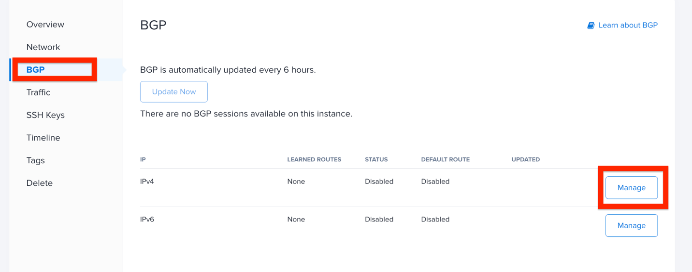
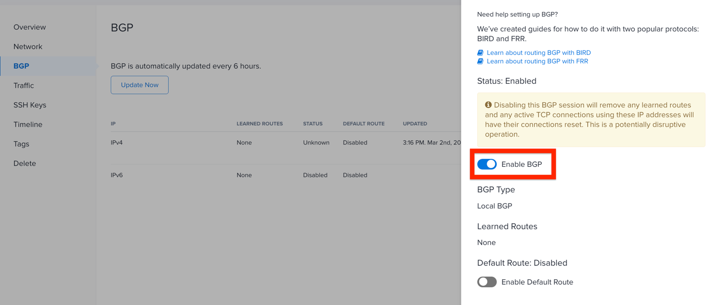

Lab #3: Enable BGP & Convert Network
====================================

In this lab you will...

Enable BGP on Metal instance
-----------------------------

Once the server is up and available, BGP for IPv4 also needs be
enabled on the Ubuntu server instance.

Figure 8: BGP for IPv4 needs be enabled on the Ubuntu server instance.

Convert Metal network
---------------------

When a Metal instance is first deployed, the two NICs are connected to
two different switches, bonded together into a single, logical interface
and supporting layer 3 only. To support the layer-2 VLANs needed for
BIG-IP deployment, the Metal network configuration needs to be converted
to **Hybrid Bonded** which supports both layer 2 and layer 3 networking.

As part of the network conversion process, you will have to assign one
of the VLANs you created earlier. You can select any VLAN and you will
assign the remaining three once the network conversion is complete. (See
Figure 9, next page.)

.. image:: ../images/image11.png
   :width: 6.5in
   :height: 4.11944in

Figure 9: As part of the network conversion process, you assign one of
the VLANs created earlier.

After the Metal network has been converted to hybrid bonded mode, assign
the three remaining VLANs to the Ubuntu instance. (See Figure 10 on the
next page.)

.. image:: ../images/image12.png
   :width: 6.5in
   :height: 4.71875in

Figure 10: Assign the three remaining VLANs to each Ubuntu instance.